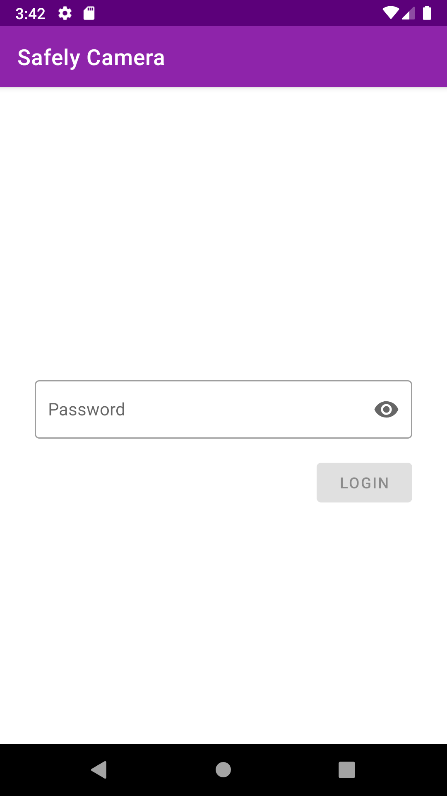
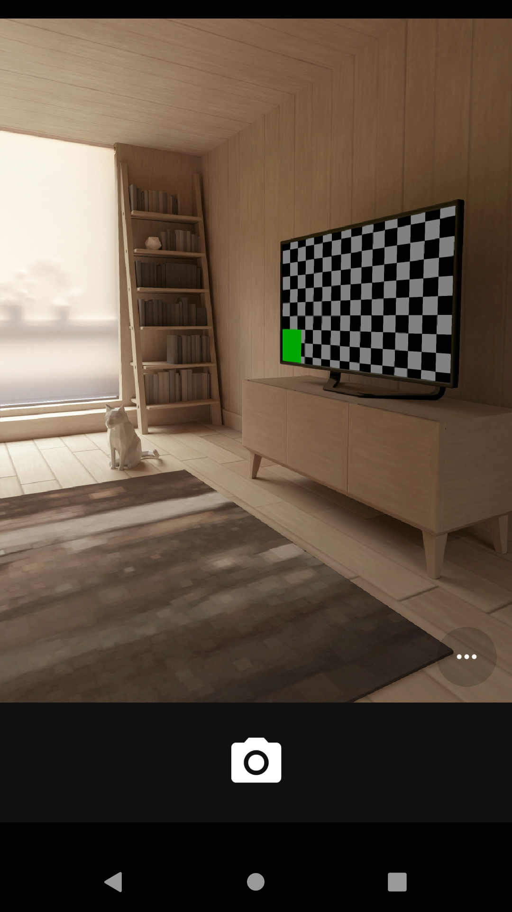

# SafelyCamera

Application that allows to take photos and store them securely - in private gallery, with photos encrypted and protected with password.

## Screenshots
Application starts with login screen

After entering password user clicks `Login`. Incorrect password displays error.

  

After putting correct password gallery is shown

User can tap FAB to start camera app

 

Captured photo is saved in private gallery

 
